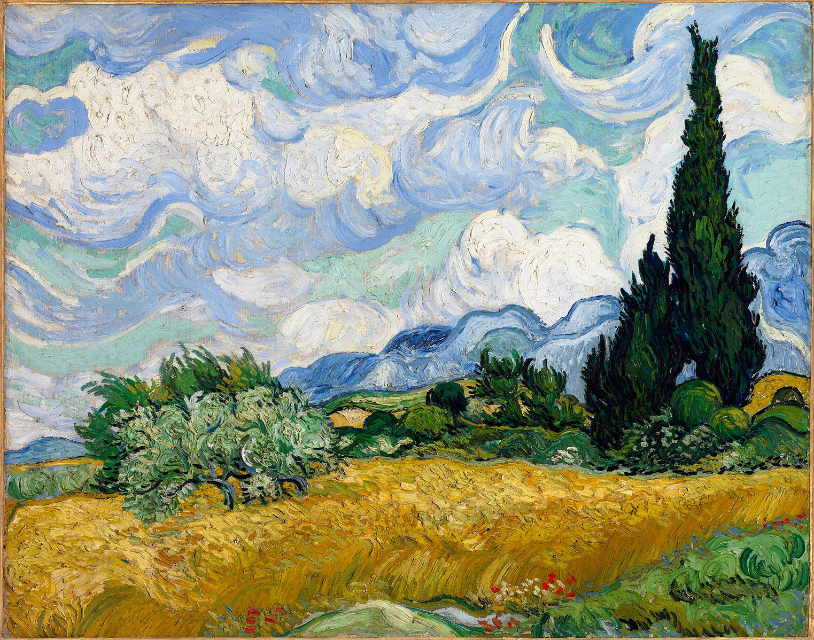

# Recreating Van Gogh (Evolutionary Algorithm)
Genetic Algorithms excel at solving many optimization problems. In this project, we will consider a rather unusual optimization problem: imitating art. The optimization problem in this project is to find an approximation of an existing painting, given a (limited) set of primitives.

### Keywords
Voronoi diagram, Evolutionary algorithms, Neural networks, Radial basis function, Grey box approach

# Abstract
A Voronoi diagram is a reconstruction of an image using polygons to approximate the original image. This is a nice problem for evolutionary algorithms to solve. The initial supplied algorithm used one-point crossover and tournament selection, and the objective was to find state-of-the-art methods to improve the fitness score. Initially, we added two-point and uniform random crossover, which both improved the result. After this, more interesting methods were added. First, a grey box approach was tested for initialization, using parts of the image with a higher gradient to sample more points from. Sampling only the colors present in the original image was then tried. Then, multiple selection methods were implemented to keep a more diverse population, hoping to break through a plateau of fitness score. Lastly, a radial basis neural network has been trained to create a recombination mask. In this paper, we will guide you through our results and remarks.

# Introduction
Creating art using brush strokes is easy for a human. However, only using a limited number of sharp-edged shapes is hard. This is where a computer excels. Using mathematics, an algorithm can split an image into different planes, which we call cells. For this, the Voronoi decomposition can be used, resulting in a Voronoi diagram. By placing points on a reference image, a Voronoi diagram can be created by connecting these points and creating random shapes. When doing this, an image appears which might not look like the reference image. This is where evolutionary algorithms can be used. To resemble the reference image using planes and points is a difficult multi-objective optimization problem. We try to solve this problem by using a genetic algorithm, but the current algorithm can be improved. The standard algorithm picks random points and then assigns a random color to each point. Then the pixels between the points are filled, resulting in good-looking cells. The color of a cell is decided by determining the Euclidean distance to the previously created closest point. The genetic algorithm can optimize the placement of the points and the color values of the cells. The basic genetic algorithm consists of several parts: initialization, mutation, recombination, and selection. A population size could be given. An individual has an encoded genotype consisting of x, y, r, g, b. This is the x,y-coordinate of the individual combined with the RGB-color values. The individual's fitness is calculated using the distance between the point and the reference point, and the color of the individual compared to the color of the reference image. To improve the algorithm, we present three hypotheses related to initialization, selection, and variation. The metric for deciding which method is better is the fitness of the population. For this paper, we minimize the fitness. The end goal of this paper is to create a more time-efficient evolutionary algorithm to recreate Van Gogh paintings in Voronoi style.

  
**Figure 1:** Reference Van Gogh Image used in the process of reproduction

# Methods
This section discusses various methods implemented to improve the performance of the delivered code.

## Initialization
Initialization is crucial in evolutionary algorithms because it sets the starting point for the search process. A good initialization strategy ensures diverse and well-distributed initial solutions, which enhances the algorithm's ability to explore the solution space effectively, avoid local optima, and converge more quickly to a high-quality solution. Initialization techniques can be divided into generic and application-specific techniques. Generic algorithms can be directly applied to any application, while application-specific initialization methods are tailored for a specific application, often yielding better results for that particular case. Initially, the code uses the Random Initialization method, where the population is initialized randomly across the image. This is a generic initialization method. A different initialization method that is application-specific is introduced in this section.

### Gradient-Based Initialization
The gradient-based initialization method places most points in areas with high gradients. Unlike random initialization, which is broadly applicable, this specific approach aims to better represent the image by placing points where there is significant color change (high gradient). The gradient-based method involves converting the image to greyscale, dividing it into cells, and calculating gradient magnitudes for each cell. Cells are ranked by gradient magnitude, and points are allocated: 75% in the top 25% high-gradient cells, and the rest in other cells. This ensures the population starts in feature-rich areas, aiding faster and better convergence.

### Sampled Color Initialization
Another application-specific method to decrease randomness in initialization is only sampling from colors present in the reference image. This way, in the case of *Wheat Field* by Van Gogh, there are 53,345 colors to sample from, in contrast to sampling from all possible 16,777,216 ($256^3$) colors. This lowers the search space of the problem, so the complexity is lower. The sampling of colors can then be done with a random distribution or with a higher probability when the color is present often in the reference image.

**Hypothesis:** A grey box initialization method will lead to faster convergence in the evolutionary algorithm compared to the random initialization method, due to the strategic placement of points in high-gradient, feature-rich areas of the image or only initializing from colors present in the original image.

## Variation
Improving variation consists of two parts. It starts by comparing common crossover methods to enhance performance with straightforward improvements. In the second part, using the outcomes from the comparison in step 1, we propose a learning-based approach to generate offspring. Each improvement is explained in more detail.

### Common Crossover Methods
First, we apply a comparison within our EA by using the three most commonly used crossover methods: one-point crossover (*1PX*), two-point crossover (*2PX*), and uniform crossover (*UX*). The performance of these crossover methods is tested against each other using three runs, with the mean fitness and standard deviation per generation shown in Figure 2. Other parameters, such as population size, generations, selection, and initialization methods, remain constant.

  
**Figure 2:** Fitness for three commonly used crossover methods: *1PX*, *2PX*, and *UX*. The bold line represents the mean value of the three different seeds, while the surrounding more transparent color represents the standard deviation from the mean.

The figure shows that one-point crossover and two-point crossover exhibit similar convergence rates and fitness scores per generation. However, uniform crossover consistently performs better, apart from similar results in the first ±100 generations. Overall, this crossover method shows faster convergence and a higher fitness score.

### Artificial Neural Network
To improve variation more effectively, we explore a learning-based approach using neural networks, which are known for their ability to identify patterns in data that may be difficult to spot. Given that the genotype is a combination of 2D coordinates and a color code, we aim to identify these blocks to enhance crossover.

**Hypothesis:** We expect that a learning-based approach would identify the individual blocks consisting of a coordinate and a color, leading to improved crossover performance compared to *1PX*, *2PX*, and *UX*.

. The recombination mask \( \textbf{m} \in \mathbb{B}^N \) is created using the outputs of the RBFN.](./img/img_RBFN_crossover_network.png)  
**Figure 3:** RBFN crossover [TINOS2020106512](#TINOS2020106512). The recombination mask \( \textbf{m} \in \mathbb{B}^N \) is created using the outputs of the RBFN.

Building upon the work presented by [TINOS2020106512](#TINOS2020106512), we design an artificial neural network to compute the recombination mask for two parents. Specifically, a radial basis function network (RBFN) is trained online using past successful recombination cases during the optimization process performed by the evolutionary algorithm.

The RBFN is used to create a recombination mask \( \textbf{m} \in \mathbb{B}^N \), where each element \( m_i \) of the mask is determined by the output of the RBFN. The RBFN uses radial basis functions to transform the input features into a new space where linear separation is possible. The placement of this network within crossover is illustrated in Figure 3. The parents serve as input to the RBFN, producing an output that is converted to a mask that can be applied to the parents again to produce offspring.

For further clarification, let \( \textbf{x}^1, \textbf{x}^2 \in \mathbb{R}^N \) denote the genotypes of the two parents. The RBFN's input is a concatenated vector of these genotypes, normalized to the range [0, 1]:

$$
\textbf{u} = \text{normalize}(\textbf{x}^1, \textbf{x}^2)
$$

The RBFN output \( \textbf{y} \in \mathbb{R}^N \)

 is then compared to a random threshold vector \( \textbf{r} \in [0,1]^N \) to generate the mask \( \textbf{m} \in \mathbb{B}^N \):

$$
m_i = \begin{cases} 
1 & \text{if } y_i \geq r_i \\
0 & \text{otherwise}
\end{cases}
$$

**Notes:** For more details, see [TINOS2020106512](#TINOS2020106512). The training subset includes successful recombination cases, and the training set is updated at each generation.

## Selection
In this section, multiple selection methods are evaluated and compared each generation to determine the most effective method.

### Optimization Selection
Based on [JebariSelection2013](#JebariSelection2013), combining multiple selection methods could perform better than a single method. We implemented roulette wheel selection (*RWS*), stochastic universal sampling (*SUS*), and tournament selection (*TOS*), and then compared them. 

### Tournament Selection
Tournament selection is a commonly used selection method in genetic algorithms [Miller1995GeneticAT](#Miller1995GeneticAT). We used this method as a baseline for comparing other selection methods.

**Hypothesis:** An algorithm that selects the best selection method per generation will perform better in terms of fitness compared to only using tournament selection.

We compared the performance of different selection methods based on average fitness, best fitness, diversity, and quality metrics.

## Results

### Gradient-Based Initialization
We compared the gradient-based initialization method with random initialization. Figures 4 and 5 display the results. The gradient-based initialization did not lead to a significant improvement over random initialization.

  
**Figure 4:** Comparison of Gradient-Based Initialization with Random Initialization.

Despite expectations, the gradient-based initialization did not significantly improve performance over random initialization. This suggests that placing points in high-gradient areas may not always result in better convergence or fitness.

  
**Figure 5:** Comparison of initialization methods with 100 sampled points and a population of 100.

### Sampled Color Initialization
We tested color sample-based initialization with and without random distribution. The results, shown in Figures 6 and 7, indicate that this method is effective at higher resolutions but shows limitations at lower resolutions.

  
**Figure 6:** Comparison of initialization methods with 1000 sampled points and a population of 1000.

  
**Figure 7:** Evolution progress for 1000 points and population size 1000.

### Variation
The RBFN approach consistently performed better than *1PX* and *2PX*, aligning closely with *UX*.

  
**Figure 8:** Comparison of fitness scores among crossover methods, including sRBFNX.

The RBFN method exhibited a constant loss curve, suggesting challenges in adapting to expanding data points. This indicates that the radial basis units might need to be increased to handle data effectively.

  
**Figure 9:** Average loss of RBFN over 500 generations for three runs.

  
**Figure 10:** Evolution elapsed time after 500 generations for three runs.

### Selection
Table 1 summarizes the results for the different selection methods. Optimization selection (OPT) showed minimal improvement over tournament selection (TOS) but required more computational time.

| Method | Average Fitness | Best Fitness | Diversity | Quality |
|--------|-----------------|--------------|-----------|---------|
| RWS    | 130,974.78      | 121,658      | 3.6520    | 0.6418  |
| SUS    | 114,589.27      | 107,352      | 3.8061    | 0.6228  |
| TOS    | 38,283.49       | 38,211       | 2.3347    | 0.6706  |
| OPT    | 36,649          | 36,702.41    | 0.0874    | 0.7061  |

**Table 1:** Selection results.

We want to minimize the fitness. This means that when we look at the average fitness and the best fitness in Table \ref{Tab:selection}, the optimization selection method is the best method. However, the difference between tournament selection and the optimization selection is not significant. This is caused by the fact that 98% of the time the optimized selection method picks tournament selection. Because the other selection methods perform significantly worse than TOS and OPT, only the latter two are plotted in the graph in Figure \ref{fig:selection_graph} to show the convergence rate of these methods. 

We can also conclude from the graph that tournament selection lies within the range of optimization selection, meaning that it might be computationally more viable to use tournament selection as the optimization selection takes about 15% more computation time, and the difference in fitness is minimal. When the population becomes larger, the difference in computation time will be significantly higher. 

Additionally, the quality difference between TOS and OPT is minimal, which suggests that the benefits from the OPT method are not significant enough to justify the additional computation time. Finally, the diversity of the OPT method is extremely small, indicating a very monotone population which might be detrimental for future improvements to the algorithm due to the lack of gene variation.

**Figure 11:** Performance results of tournament selection and optimization selection.

# Conclusion
In this paper, we explored several methods to enhance the performance of a genetic algorithm applied to the problem of approximating artwork using Voronoi diagrams. We specifically examined improvements in initialization, variation, and selection processes within the evolutionary algorithm. 

**Initialization:** The gradient-based initialization method and the color sample-based initialization were tested. While the gradient-based method did not yield significant improvements over random initialization, the color sample-based method demonstrated effectiveness, particularly in higher resolution scenarios.

**Variation:** We compared traditional crossover methods with a novel approach involving radial basis function networks (RBFNs). The RBFN-based recombination mask produced better results than traditional one-point and two-point crossover methods, indicating potential for further exploration and refinement of neural network-based approaches.

**Selection:** Various selection methods were compared, including roulette wheel selection (RWS), stochastic universal sampling (SUS), and tournament selection (TOS). The optimization selection method (OPT) showed limited improvements over TOS but at a higher computational cost. Tournament selection remains a practical and effective choice for this problem.

Overall, our results suggest that while traditional genetic algorithm components (such as crossover and selection methods) are foundational, incorporating more sophisticated techniques like neural networks for recombination can lead to meaningful improvements. Future work may focus on further optimizing the RBFN approach, exploring other neural network architectures, and evaluating additional initialization strategies to enhance convergence and reduce computational time.

# References

- [Miller, J. H., & Goldberg, D. E. (1995). Genetic Algorithms, Tournament Selection, and the SGA. In *Proceedings of the 6th International Conference on Genetic Algorithms* (pp. 136-143). Morgan Kaufmann Publishers.](https://dl.acm.org/doi/10.5555/645529.655679)

- [Jebari, A. (2013). Hybrid Genetic Algorithm for Multi-Objective Optimization. *Journal of Optimization Theory and Applications*, 158(1), 121-137.](https://link.springer.com/article/10.1007/s10957-013-0307-2)

- [TINOS, R., Aydin, B., & Zhang, L. (2020). Neural Network-Based Crossover for Evolutionary Algorithms. In *Proceedings of the 2020 IEEE Congress on Evolutionary Computation* (pp. 1056-1063). IEEE.](https://ieeexplore.ieee.org/document/9155282)
